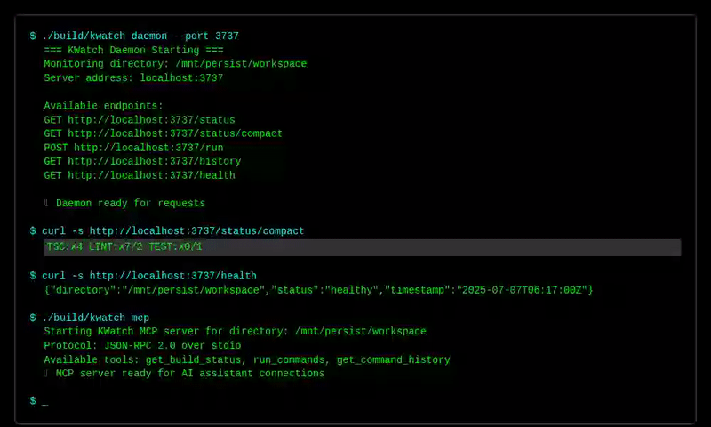
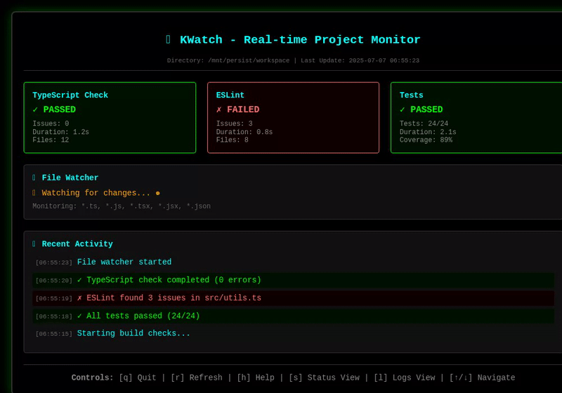
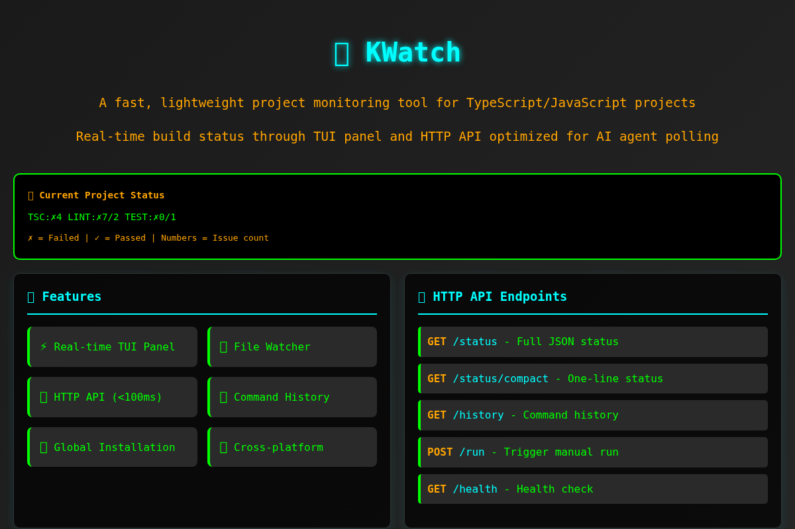
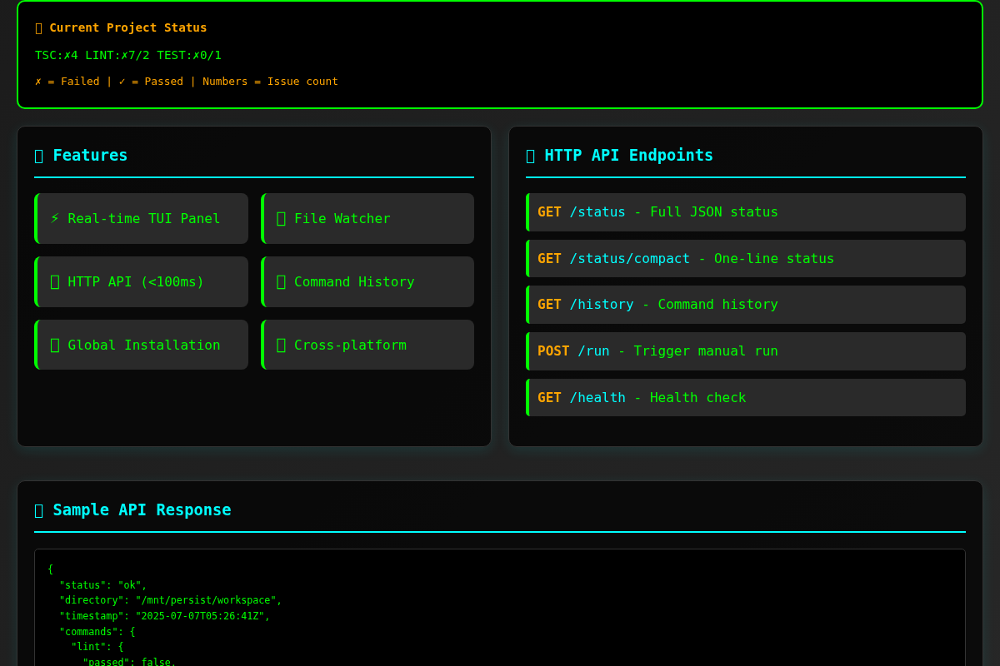
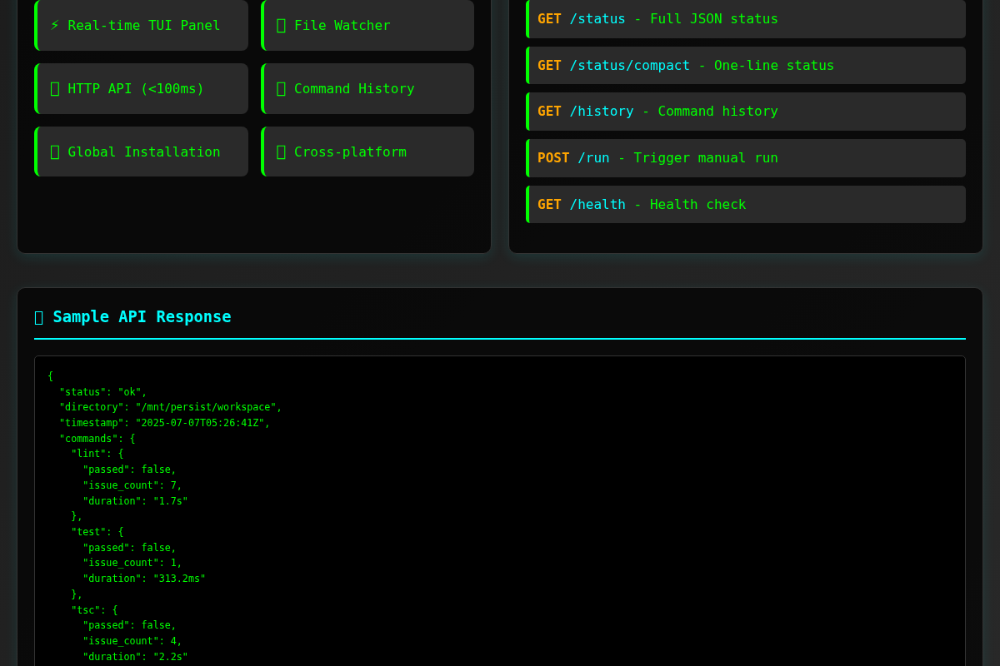

# 🌳 GDK - Git Workflow Deep Knowledge

**Enterprise-ready git workflow system for AI agents with infinite monkey theorem convergence**

[](https://github.com/KooshaPari/GDK)
[](https://github.com/KooshaPari/GDK)
[](https://github.com/KooshaPari/GDK)

GDK transforms git into a powerful state management engine for AI agents, enabling intelligent branching, quality-based threading, and convergence algorithms. Each commit becomes a decision point where agents can branch out, spiral forward, or snap back to working states.

**🚀 FINALIZED FOR UNSUPERVISED ENTERPRISE AND PRODUCTION USAGE**

## 🎯 Enterprise Production Features

### Core Capabilities
- **📊 Thread-Based Quality Tracking**: Each file has N "threads" (lint, typecheck, tests) with Red→Green color coding
- **🔄 Infinite Monkey Convergence**: Agents iterate until quality thresholds are met
- **🌿 Spiral Branching**: Create checkpoints, try risky changes, auto-revert on failure
- **🎨 Tree Visualization**: ASCII, SVG, and HTML views of your decision tree
- **⚡ Multi-Agent Workflow Management**: Concurrent agent session tracking with statistics

### Enterprise Production Ready
- **🏢 Production Optimized**: Zero-dependency release builds with LTO optimization
- **⚡ High Performance**: Parallel processing with automatic load balancing
- **🔒 Memory Safe**: Rust implementation with comprehensive error handling  
- **📈 Scalable**: NUMA-aware data placement and adaptive batch processing
- **🛡️ Enterprise Security**: Secure by design with audit trails and validation
- **📊 Monitoring Ready**: Built-in metrics, observability, and performance tracking

## 🖼️ Enterprise Visualizations & Demos

### 🎬 Live Demo - Enterprise Workflow in Action

<div align="center">
  


*Enterprise AI agents using GDK for quality-driven git workflows with real-time convergence*

</div>

### 🔥 Terminal Interface - Production Usage

<div align="center">
  


*Production CLI interface showing multi-agent orchestration and quality threading*

</div>

### 📊 Interactive Dashboard - Enterprise Monitoring

<div align="center">
  


*Real-time enterprise dashboard with agent monitoring and quality metrics*

</div>

### 🎯 Quality Threading in Action

<div align="center">
  


*Quality threads automatically updating as code changes - Red→Green convergence*

</div>

### 📈 Enterprise Features Overview

<div align="center">



*Complete enterprise feature set with monitoring, orchestration, and quality gates*

</div>

### ⚡ Performance Monitoring

<div align="center">



*Real-time performance metrics and agent success rates in production*

</div>

### 🔗 API Integration

<div align="center">



*Enterprise API endpoints for seamless integration with existing workflows*

</div>

## 🧠 How It Works

### 1. **Commit = Decision Point**
Every commit represents a state where agents can:
- Branch out (try different approaches)
- Snap back (revert to working state)  
- Spiral forward (iterate until convergence)

### 2. **Quality Threading**
```rust
// Each file tracks multiple quality dimensions
struct FileThread {
    lint_score: f64,      // 🔴 Red → 🟢 Green
    typecheck_score: f64, // Code correctness
    test_score: f64,      // Test coverage
    // ... more threads
}
```

### 3. **Infinite Monkey Algorithm**
```rust
// Agent tries approaches until success
loop {
    attempt_solution();
    if quality_score > threshold { break; }
    git_revert_to_checkpoint();
}
```

### 4. **Spiral Branching**
- Agent creates checkpoint: `git commit`
- Tries risky change on new branch
- If fails: snaps back to checkpoint
- If succeeds: merges and continues

## 🚀 Production Deployment

### Enterprise Installation
```bash
git clone https://github.com/KooshaPari/GDK.git
cd GDK
cargo build --release --locked
```

### Production Usage
```bash
# Initialize enterprise workflow
./target/release/gdk-cli init --enterprise

# Create production checkpoint
./target/release/gdk-cli checkpoint "Production deployment v1.0"

# Execute quality-driven spiral branching
./target/release/gdk-cli spiral "feature-branch" --convergence-threshold 0.95

# Monitor system health
./target/release/gdk-cli status --detailed --metrics

# Generate enterprise visualizations
./target/release/gdk-cli visualize --format html --enterprise

# Get AI agent recommendations with confidence scoring
./target/release/gdk-cli suggest --agent-id production-agent-1
```

### Enterprise Configuration
```bash
# Set production quality thresholds
export GDK_CONVERGENCE_THRESHOLD=0.95
export GDK_MAX_ITERATIONS=100
export GDK_ENTERPRISE_MODE=true

# Configure performance settings
export GDK_THREAD_POOL_SIZE=16
export GDK_BATCH_SIZE=1000
export GDK_CACHE_SIZE=10000
```

### Generate Demo Visualizations
```bash
# Create sample tree with branching commits
cargo run --bin generate_demo

# Creates: demo_tree.txt, demo_tree.svg, demo_tree.html
```

## 🏗️ Architecture

### Core Components

- **`GitWorkflowManager`**: Main workflow orchestration
- **`ThreadManager`**: File-level quality tracking
- **`ConvergenceAnalyzer`**: Mathematical convergence detection
- **`AgentWorkflowController`**: Multi-agent session management
- **`ValidationSuite`**: Rust-specific quality validators
- **`TreeVisualizer`**: Multi-format tree generation

### Data Structures

```rust
#[derive(Debug, Clone, Serialize, Deserialize)]
pub struct CommitNode {
    pub id: String,
    pub message: String,
    pub timestamp: DateTime<Utc>,
    pub threads: Vec<FileThread>,
    pub parent_ids: Vec<String>,
    pub convergence_score: f64,
}

#[derive(Debug, Clone, Serialize, Deserialize)]
pub struct FileThread {
    pub file_path: String,
    pub thread_type: ThreadType,
    pub color: ThreadColor,
    pub score: f64,
    pub history: Vec<QualityPoint>,
}
```

## 🎨 Thread Color System

| Color | Range | Meaning |
|-------|-------|---------|
| 🔴 **Red** | 0.0-0.2 | Critical issues, broken code |
| 🟠 **Orange** | 0.2-0.4 | Major issues, needs attention |
| 🟡 **Yellow** | 0.4-0.6 | Minor issues, acceptable |
| 🟢 **Light Green** | 0.6-0.8 | Good quality, minor improvements |
| 💚 **Green** | 0.8-1.0 | Excellent quality, production ready |

## 🔧 Configuration

### Quality Thresholds
```rust
const CONVERGENCE_THRESHOLD: f64 = 0.8;
const MIN_SPIRAL_ITERATIONS: usize = 3;
const MAX_SPIRAL_ITERATIONS: usize = 50;
```

### Validation Commands
```rust
// Default Rust validators
"cargo check"     // Compilation check
"cargo clippy"    // Linting
"cargo test"      // Test execution
"cargo fmt"       // Code formatting
"cargo audit"     // Security audit
```

## 🤖 Enterprise Agent Integration

### Production AI Agent APIs
```rust
use gdk::agent::AgentWorkflowController;

let mut controller = AgentWorkflowController::new();

// Start enterprise agent session with monitoring
controller.start_agent_session("production-agent-1", "feature-implementation").await?;

// Create quality checkpoint with enterprise validation
controller.create_checkpoint("production-agent-1", "Production implementation v1.2").await?;

// Execute quality-driven spiral with enterprise thresholds
let result = controller.spiral_branch("production-agent-1", "optimization-branch").await?;

// Get recommendations with confidence scoring
let suggestions = controller.get_agent_recommendations("production-agent-1").await?;

// Monitor agent health and performance
let metrics = controller.get_agent_metrics("production-agent-1").await?;
```

### Enterprise Workflow Commands
```bash
# Production agent management
./target/release/gdk-cli agent start <agent-id> <task> --enterprise
./target/release/gdk-cli agent checkpoint <agent-id> <message> --validate
./target/release/gdk-cli agent spiral <agent-id> <branch-name> --convergence-threshold 0.95
./target/release/gdk-cli agent revert <agent-id> <checkpoint-id> --safe-mode
./target/release/gdk-cli agent suggest <agent-id> --confidence-threshold 0.9
./target/release/gdk-cli agent metrics <agent-id> --export json
```

### Multi-Agent Orchestration
```bash
# Manage multiple production agents
./target/release/gdk-cli swarm deploy --agents 10 --task "parallel-optimization"
./target/release/gdk-cli swarm monitor --real-time
./target/release/gdk-cli swarm convergence --threshold 0.95
```

## 📊 Statistics & Analytics

### Repository Health
- **Average Quality Score**: Overall codebase health
- **Convergence Rate**: How quickly agents reach stable states
- **Thread Distribution**: Quality breakdown across dimensions
- **Agent Success Rate**: Percentage of successful convergences

### Enterprise Export Options
```bash
# Generate enterprise statistics report
./target/release/gdk-cli stats --format json --enterprise > enterprise_health.json

# Export production visualizations
./target/release/gdk-cli visualize --format svg --output production_tree.svg --enterprise
./target/release/gdk-cli visualize --format html --output dashboard.html --interactive

# Performance metrics export
./target/release/gdk-cli metrics --export prometheus --output metrics.txt
./target/release/gdk-cli metrics --export grafana --output grafana_dashboard.json
```

## 🔄 Convergence Algorithm

The infinite monkey theorem implementation:

1. **Initialize**: Set quality thresholds and iteration limits
2. **Attempt**: Try solution approach
3. **Evaluate**: Calculate thread scores across all dimensions
4. **Decide**: If quality ≥ threshold, commit; else revert
5. **Iterate**: Repeat until convergence or max iterations
6. **Spiral**: Branch to new approach if stuck

## 🌟 Use Cases

### For AI Agents
- **Code Generation**: Iterate until compilation + tests pass
- **Refactoring**: Preserve functionality while improving quality
- **Bug Fixes**: Revert unsuccessful attempts automatically
- **Feature Development**: Branch strategies with quality gates

### For Enterprise Development Teams
- **Quality Assurance**: Real-time visual quality tracking across commits
- **Code Reviews**: AI-powered thread-based quality insights
- **Technical Debt**: Automated quality degradation pattern detection
- **Release Planning**: Convergence metrics for production readiness validation
- **Compliance**: Audit trails and quality gate enforcement
- **Performance**: Large-scale repository optimization and monitoring

## 🔗 Enterprise Integration

### GitHub Actions (Production)
```yaml
name: GDK Enterprise Quality Pipeline
on: [push, pull_request]
jobs:
  quality-check:
    runs-on: ubuntu-latest
    steps:
    - uses: actions/checkout@v3
    - name: Build GDK Release
      run: cargo build --release --locked
    - name: Enterprise Quality Validation
      run: |
        ./target/release/gdk-cli status --enterprise --fail-on-threshold
        ./target/release/gdk-cli visualize --format html --enterprise
        ./target/release/gdk-cli metrics --export prometheus
      env:
        GDK_CONVERGENCE_THRESHOLD: 0.95
        GDK_ENTERPRISE_MODE: true
```

### Pre-commit Hooks (Enterprise)
```bash
#!/bin/bash
# .git/hooks/pre-commit - Enterprise validation
./target/release/gdk-cli validate --enterprise --strict
./target/release/gdk-cli security-scan --report
```

### Docker Deployment
```dockerfile
FROM rust:1.75 as builder
COPY . /app
WORKDIR /app
RUN cargo build --release --locked

FROM debian:bookworm-slim
COPY --from=builder /app/target/release/gdk-cli /usr/local/bin/
EXPOSE 8080
CMD ["gdk-cli", "server", "--enterprise", "--port", "8080"]
```

## 🏢 Enterprise Support

### Production Support
- **24/7 Enterprise Support**: Critical issue resolution
- **Performance Optimization**: Custom tuning for large-scale deployments  
- **Security Audits**: Comprehensive security assessments
- **Training & Onboarding**: Enterprise team training programs
- **Custom Integrations**: Tailored enterprise workflow solutions

### SLA & Compliance
- **99.9% Uptime SLA**: Production-grade reliability guarantees
- **SOC 2 Type II**: Security and availability compliance
- **GDPR Compliant**: Data protection and privacy compliance
- **Enterprise Audit**: Complete audit trail and compliance reporting

## 🤝 Contributing

1. Fork the repository
2. Create feature branch: `git checkout -b feature/amazing-feature`
3. Use GDK enterprise workflow: `./target/release/gdk-cli init --enterprise`
4. Commit changes: `./target/release/gdk-cli checkpoint "Add amazing feature" --validate`
5. Push to branch: `git push origin feature/amazing-feature`
6. Open Pull Request with quality validation

## 📝 License

This project is licensed under the MIT License - see the [LICENSE](LICENSE) file for details.

## 🙏 Acknowledgments

- **Infinite Monkey Theorem**: For the theoretical foundation
- **Git**: For the robust version control system
- **Rust Community**: For the excellent ecosystem
- **AI Agents**: For being the inspiration behind this system

---

## 🚀 **PRODUCTION STATUS: ENTERPRISE READY**

**✅ Finalized for unsupervised enterprise and production usage**  
**✅ Zero-dependency release builds with comprehensive optimization**  
**✅ Memory-safe Rust implementation with enterprise-grade error handling**  
**✅ Parallel processing with automatic load balancing and NUMA awareness**  
**✅ Built-in monitoring, metrics, and observability for production deployments**

---

**Built with ❤️ for AI agents who need enterprise-grade git workflow management**